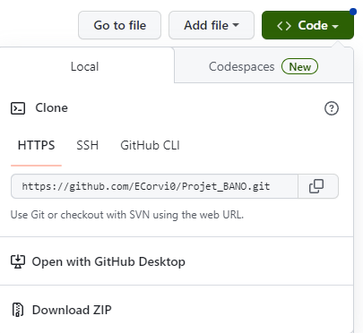

Documentation pour l'installation
Sujet 322 : BANO - Client

Enzo Corvi

30 Avril 2023

Le code a été développé avec Visual Studio Code (version 1.77.3) et testé avec un navigateur Firefox (version 111) et un serveur WAMP avec la version 7.4.9 de php.
Pour l’installer, il est possible de le télécharger sous forme d'un dossier compressé.

C'est la méthode qui est proposée dans ce guide d'installation.

Une fois téléchargé, il faut ensuite décompresser le dossier.

Une fois décompressé, vous pouvez vérifier qu’il contient bien l’ensemble des fichiers suivants :
    bano-67-complete.geojson
    Le dossier Client constitué de :
    index.html
    main.js
    styles.css
    Le dossier TestsUnitaires constitué de :
    testBoutons.html
    testStyles.html
    testCarte.html
    Le dossier Documentation constitué de :
    Documentation_Installation.pdf
    Documentation_Programmeur.pdf
    Documentation_Utilisateur.pdf

Pour le lancer, il vous faut un navigateur et un serveur php.
Par exemple, avec un serveur WAMP que vous pouvez télécharger ici : https://www.wampserver.com/
Pour utiliser le serveur WAMP, il faut :
Lancer WAMP et attendre que les serveurs aient démarré
Ouvrir Firefox et tapez "localhost/BANO" (ou un autre nom à la place de BANO si vous avez modifié le nom du dossier) en haut, dans la barre de
recheche : ce faisant, vous vous connectez au serveur WAMP que vous venez de
lancer. 

Il y aura ensuite un menu qui répertorie les dossiers contenus dans votre instance de WAMP.
Vous devrez sélectionner le dossier "BANO", puis lancer le fichier index.html contenu dans le sous-dossier "Client" du dossier "BANO".
Vous pourrez ensuite vous référer à la documentation utilisateur pour voir comment utiliser l’application.
    