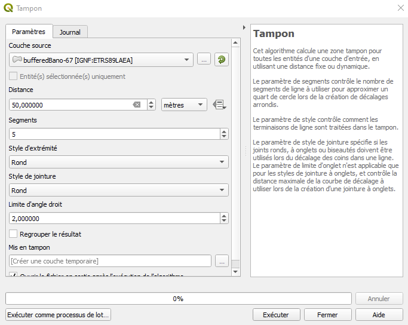

Ce document présente les différents fichiers qui constituent le rendu de ce projet.

Partie 1 : La partie client

1.1 Page HTML

La page HTML contient balises qui servent d'emplacements pour afficher les différentes informations que le client doit récupérer.

1.2 CSS

Le fichier styles.css règle la taille de la carte. 

1.3 JavaScript

Le fichier main.js sert à communiquer avec le serveur par AJAX des données échangées en format GeoJson, pour l'envoi comme pour le retour de la requête.

Le script main.js commence par la création d'une carte Leaflet via la fonction "map".

Cette carte reçoit un fond de carte issu d'un flux de données WMTS Géoportail.

Après l'initialisation de la carte et du fond de carte, je crée deux fonctions getBinaryColor() et getShadedColor() qui définissent respectivement la couleur qui sera renvoyée pour l'affichage binaire et pour l'affichage graduel.

L'affichage binaire définit deux couleurs, le rouge et le vert.
Un carreau qui ne contient aucune adresse est affiché en rouge, tandis qu'un carreau qui contient des adresses est affiché en vert.

L'affichage graduel définit un spectre dont les extrémités sont le noir (absence d'adresses) et le vert.
L'intensité du vert est égal au ratio population/adresses.

Il est théoriquement possible, dans le cas du ratio avec buffer d'obtenir un ratio supérieur à 1, vu qu'il est impossible de connaître exactement la population dans un rayon inférieur à 200 mètres (taille des plus petits carreaux) autour d'un carreau, et que le buffer est de seulement 50 mètres.

Pour que ça n'arrive pas trop souvent, un facteur correctif a été ajouté dans la configuration avec buffer.

Un ratio supérieur à 1 sera affiché identiquement à un ratio égal à 1.
Il existe donc des conséquences à ce choix normalement géré par le serveur, mais elles restent peu importantes, et ne modifient pas la compréhension de l'information par l'utilisateur.

Je définis ensuite les fonctions de style binaryStyle(feature), binaryBufferedStyle(feature), shadedStyle(feature) et shadedBufferedStyle(feature).

Les 4 styles possibles (2*2, respectivement pour la couleur, et l'attribut à utiliser) sont ensuite réunies dans une fonction mapStyle(), qui définit le style pour la grille vide geoJsonGrid qui contiendra les données carroyées.

La construction des données utilisées, et la création des deux attributs qui en découle et justifie le recours à 4 styles est décrite dans la partie 2 sur le jeu de données.

La fonction getGrid() permet d'afficher la grille.

C'est dans cette fonction que la communication avec le serveur se fait via AJAX.

J'ai aussi ajouté une fonction createGrid() pour éviter l'apparition de grilles sans styles, problème que j'ai pu détecter grâce aux tests unitaires définis en Partie 3.

Il y a enfin des boucles sur les boutons radio, qui permettent de les décocher par Ctrl+clic.

Partie 2 : Le jeu de données des tests unitaires

Mon jeu de données est composé de fichiers geojson que j'ai retraités avec QGIS 3.12.

Les fichiers utilisés pour le traitement :
- Base d'adresses BANO de l'INSEE
- Carreaux INSEE de 200 mètres

Le traitement :

Je disposais au départ de carreaux INSEE pour chaque département mais les informations fournies étaient incomplètes.
J'ai ensuite téléchargé la BANO (https://adresse.data.gouv.fr/data/ban/adresses/latest/csv/)
À partir de ce fichier CSV contenant les adresses, j'ai augmenté les données carroyées en y ajoutant l'information du nombre d'adresses contenues dans chaque carreau, grâce à la fonction QGIS "Count points in polygon".

J'ai obtenu en sortie une couche qui reprend les attribus de la couche avec les carreaux INSEE, et possède un attribut "NUMPOINTS" qui donne le nombre d'adresses contenu dans chaque carreau.
J'ai ensuite utilisé la fonction buffer sur cette couche pour créer la version avec buffer et lui ai aussi appliqué la fonction "Count points in polygon".

J'ai fait ce choix en raison de l'absence de données carroyées avec buffer, et pour m"assurer d'avoir des nombres justes.
J'avais pensé dans un premier temps à créer un attribut "NUMPOINTS_BUFFERED", qui serait l'attribut "NUMPOINTS" multiplié par 9/4, pour corriger la différence de surface liée au buffer.
Il existe cependant des cas où il n'y a aucune adresse dans un carreau de 200 mètres de côté mais où des points existent 50 mètres autour.
Cette observation m'a conduit à réitérer la fonction QGIS "Count points in polygon", mais cette fois-ci sur la couche avec buffer.

J'ai ensuite effectué une jointure spatiale des deux grilles de données carroyées qui contiennent un attribut "NUMPOINTS" pour récupérer le nombre de points dans la configuration avec buffer et avoir l'information avec buffer et l'information sans buffer dans une même grille, celle sans buffer.

J'ai utilisé une grille d'un département entier (Bas-Rhin) en carreaux de 200 mètres, sur laquelle j'ai appliqué les traitements décrits ci-dessus. En raison de sa taille importante (environ 20 000 carreaux), la grille met quelques secondes à s'afficher.

C'est cette couche finale qui me sert de données, qui sont générées par le script main.js et affichées par la page index.html.

Ce sont des conditions plus dures que celles décrites par EF321, qui concerne la partie serveur, mais qui permettent d'avoir une première approche en ce qui concerne la performance.

Partie 3 : Les tests unitaires

Les tests unitaires consistent en des pages html qui vérifient que les éléments de la page fonctionnent bien et qu'ils renvoient les bonnes informations.

Partie 3.1 : testGrille.html

Cette page vérifie quelles combinaisons de boutons sont possibles, et parmi les combinaisons possibles, lesquelles appellent le serveur, simulé ici par un fichier GeoJson.

PArmi les 16 combinaisons théoriquement possibles, 7 sont empêchées par le fonctionnement des boutons radio, qui ne permettent qu'un bouton coché pour un "name" donné.

Les 9 combinaisons restantes se classent en deux séries de tests.

Une série de 5 tests, où moins de 2 boutons sont cochés.

Aucune grille n'est censée s'afficher dans cette série.

Une série de 4 tests, où 2 boutons sont cochés.

Les tests de cette série doivent afficher une grille.

La validité du style associé à chacune de ces combinaisons est l'objet de la sous-partie suivante.

Partie 3.2 : testStyles.html

Cette page vérifie quel style est appelé pour chaque combinaison parmi celles qui appellent une grille.

Celles qui ne sont pas censées appeler de grilles sont aussi testées, pour éviter un potentiel bug lié à une interaction imprévue entre la grille et les styles qui peuvent y être associés.

Partie 3.3 : testCarte.html

Cette page vérifie les différents mouvements qui amènent à un rechargement des données.

