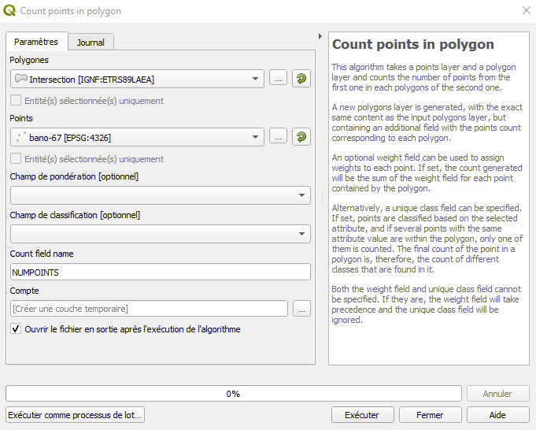

# Documentation

Il s'agit d'une documentation technique, qui explique les différentes parties de l'application.

L'application contient deux fonctions.

La première affiche le fond de carte. Pour cela, un flux de données Géoportail est utilisé.

Cela est possible grâce à l'adresse, qui peut être obtenue via la documentation disponible sur le [Géoportail](https://geoservices.ign.fr/documentation/services/utilisation-web).

La seconde afiche des données carroyées issues de [l'INSEE](https://insee.fr)

## Création des données serveur

Les données serveur proviennent d'un traitement sous QGIS.

### Intersection

J'ai utilisé l'intersection à deux reprises.

La première a servi à dimensionner les données à l'échelle d'un département.

Un problème s'est posé au moment de créer les zones tampons.

La projection WGS84, qui est utilisée pour le fond de carte, ne pouvait admettre un tampon en mètres.

J'ai donc recouru au RGF93 pour créer la zone tampon avant de revenir au WGS84 par l'intersection.

L'utilisation de l'intersection comme reprojection est ma seconde utilisation de l'intersection.

### Count points in Polygon

Après l'intersection entre un contour départemental et les grilles caroyées, j'ai introduit la base d'adresses, représentée par des points.

J'ai ensuite utilisé la fonction _Count in Polygon_ pour calculer le nombre d'adresses dans chaque carreau de la grille de données carroyées, à partir de la grille carroyée et de la base d'adresses.

### Buffer

Afin de pouvoir afficher les résultats avec buffer, j'en ai créé un avec QGIS via la fonctionnalité _Tampon_.

J'ai ensuite appliqué à la grille nouvellement créée le traitement par la fonctionnalité _Count in Polygon_.

### Conversion en GeoJSON

La conversion en GeoJSON se fait via QGIS.

Il est en effet possible d'exporter sa couche au format GeoJSON, ainsi que d'autres formats.

## Application client

### Fond de carte

Le fond de carte provient d'un flux WMTS du [Géoportail](https://geoservices.ign.fr/documentation/services/utilisation-web/affichage-wmts).

### Boutons

#### Boutons radio

Les boutons radio permettent d'alterner entre les deux grilles possibles (avec et sans buffer), et de décider de la visualisation souhaitée.

Il existe deux visualisations. Une visualisation binaire, qui détermine la présence ou l'absence d'adresses, ainsi qu'une visualisation graduelle qui représente la qualité de la couverture de la grille par la BANO.

#### Boutons d'exécution

Il y a deux boutons d'exécution.

Le bouton _Valider_ est le principal bouton d'exécution, qui permet à l'utilisateur de décider quand la grille doit s'afficher.

Le bouton _Actualiser_ est présent pour recharger la page une fois qu'une grille est affichée, pour éviter d'éventuels problèmes de superposition.

### Affichage des données carroyées

Les données carroyées s'affichent en appuant sur le bouton _Valider_.

Le bouton _Actualiser_ recharge la page, ce qui est à faire entre deux utilisations du bouton _Valider_.

