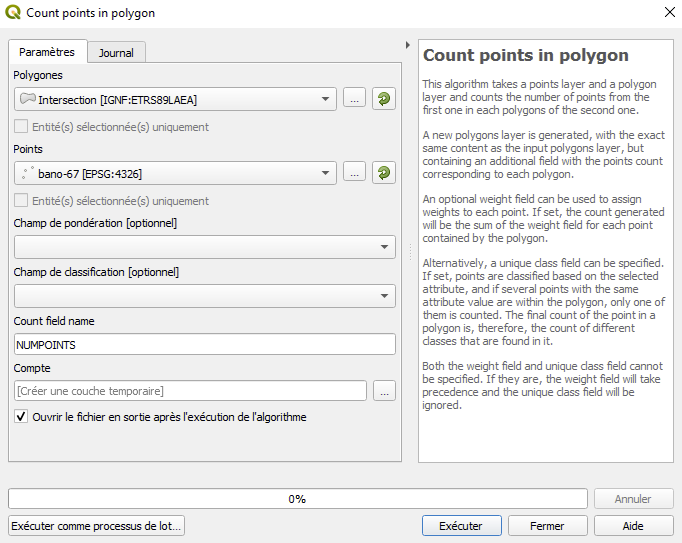

# Documentation

Il s'agit d'une documentation technique, qui explique les différentes parties de l'application.

L'application contient deux fonctions.

La première affiche le fond de carte. Pour cela, un flux de données Géoportail est utilisé.

Cela est possible grâce à l'adresse, qui peut être obtenue via la documentation disponible sur le Géoportail.

## Création des données serveur

Les données serveur proviennent d'un traitement sous QGIS.

### Intersection

J'ai utilisé l'intersection à deux reprises.

Un problème s'est posé au moment de créer les zones tampons.

La projection WGS84, qui est utilisée pour le fond de carte, ne pouvait admettre un tampon en mètres.

J'ai donc recouru au RGF93 pour créer la zone tampon avant de revenir au WGS84 par l'intersection.

### Count points in Polygon

### Buffer

### Conversion en GeoJSON

La conversion en GeoJSON se fait via QGIS.

Il est en effet possible d'exporter sa couche au format GeoJSON, ainsi que d'autres formats.

## Application client

### Fond de carte

### Boutons

#### Boutons radio

Les boutons radio permettent d'alterner entre les deux grilles possibles (avec et sans buffer), et de décider de la visualisation souhaitée.

Il existe deux visualisations. Une visualisation binaire, qui détermine la présence ou l'absence d'adresses, ainsi qu'une visualisation graduelle qui représente la qualité de la couverture de la grille par la BANO.

#### Boutons d'exécution

Il y a deux boutons d'exécution.

Le bouton "Valider" est le principal bouton d'exécution, qui permet à l'utilisateur de décider quand la grille doit s'afficher.

Le bouton "Actualiser" est présent pour recharger la page une fois qu'une grille est affichée, pour éviter d'éventuels problèmes de superposition.

### Affichage des données carroyées

