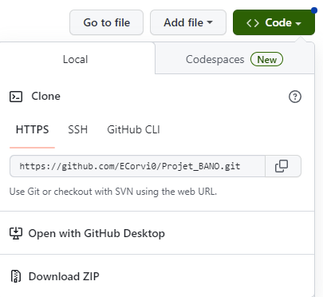
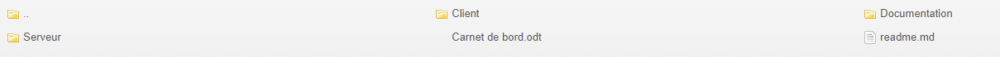

# README

L'application est à télécharger sous forme d'un dossier compressé.

Une fois téléchargé, il faut ensuite décompresser le dossier.

J'ai appelé ce dossier _projet BANO_, mais vous pouvez le renommer.

BANO signifie Base d’Adresses Nationale Ouverte.

L'application est contenue dans un dossier, qui contient lui-même trois sous-dossiers.

Le dossier client contient le code de l'application.

L'application comporte une page HTML, rendue dynamique par un programme Javascript.

Le dossier serveur contient les données que doit traiter l'application.

Pour visualiser le résultat, j'ai utilisé _Live Server_ de VSCode, qui permet de créer un virtualhost.

Pour que l'application fonctionne, l'application doit ne pas être la racine du serveur créé via _Live Server_.

Le dossier images sert à illustrer la documentation, qui utilise le langage _Markdown_.

## Lancement de l'application

Au lancement de _Live Server_, le dossier _projet BANO_ s'afichera parmi les autres.

Il faut cliquer dessus puis sur le sous-dossier _Client_, puis sur le fichier index.html qui se trouve dans ce sous-dossier.

Il y a deux boutons d'exécution.

Le bouton "Valider" est le principal bouton d'exécution, qui permet à l'utilisateur de décider quand la grille doit s'afficher.

Le bouton "Actualiser" est présent pour recharger la page une fois qu'une grille est affichée, pour éviter d'éventuels problèmes de superposition.
